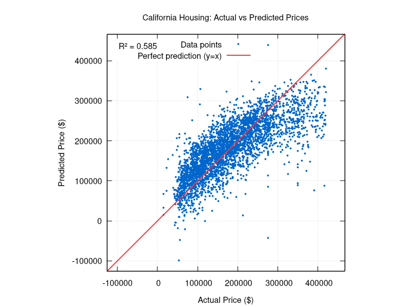

## پروژه یادگیری ماشین دانشگاه

### بیلد کردن با کمپایلر gnu
کافی است `make` را اجرا کنید. برای لیستی از عملیات های موجود دیگر `make help` را اجرا کنید
### اجرای سریع در Unix Based ها
ابتدا پکیج `gnuplot` رو نصب کنید:
```
# Debian based
sudo apt update && sudo apt install gnuplot

# Arch based
sudo pacman -S gnuplot

# based Gentoo
sudo emerge --ask sci-visualization/gnuplot

# Mac
brew install gnuplot

# Ones who use DNF idk
sudo dnf install gnuplot

# The ones that use yum idfk
sudo yum install gnuplot
```
کامند زیر را در اجرا کنید:
```
chmod +x demo.sh
./demo.sh
```

---

*مثال خروجی نرم افزار توسط `gnuplot`*
### خلاصه
در این دروژه ما سعی داریم که دیتاست در اختیار داده شده که حاوی داده های housing هستش رو بخونیم 
داده ها رو یک دست و تمیز کنیم و با ترین کردن روی بخشی از اون داده ها مدل خطی بسازیم و با اون مدل خطی بخش باقی مانده دیتاست رو روش تست کنیم و قیمت های حدس زده رو به دست بیاریم

دیتاست به صورت کلی حاوی ستون های زیر هستش:
```csv
longitude,latitude,housing_median_age,total_rooms,total_bedrooms,population,households,median_income,median_house_value,ocean_proximity
```
به ترتیب ستون ها به شکل زیر هستند:

1. طول جغرافیایی
2. عرض جغرافیایی
3. سن میانه
4. تعداد اتاق ها
5. تعداد اتاق خواب ها
6. تعداد جمعیت
7. خانوار ها
8. میانه حقوق
9. میانه قیمت خانه
10. فاصله از اقیانوس

ما قرار هستش مدل خطی خودمون رو برای ویژگی های ۱ تا ۸ و شماره ۱۰ train کنیم تا خروجی ۹ رو بتونیم حدس بزنیم و بعد اختلافش رو با قیمت واقعی حساب کنیم تا مدل بهتر بشه

نکته قابل توجه هم این هستش که شماره ۱۰ یک داده کیفی ترتیبی هستش برعکس بقیه که کمی پیوسته هستند و طور دیگری باید با آن رفتار شود


---
# انتخاب های ما

1. برای گرفتن ورودی از command line argument استفاده کردیم
2. فایل رو به صورت خط به خط خوانده و خط های مخرب رو پیدا کردیم
3. فقط آماره های زیر رو برای هر ستون به دست آوردیم:‌ min, max, median, mean
4. خانه های گمشده رو با روش Mean Imputation انجام میدیم  
5. ستون کیفی Ocean Proximity با روش ساده Label Encoding مقدار دهی شده
6. حذف کردن داده های پرت با روش `zscore`  
7. نرمالایز کردن داده ها بین بازه ای مشخص با روش Robust Scaling که لازم به چند آماره دیگر است (چارک ها)
8. استفاده از گرادیان کاهشی برای train کردن مدل با decay 
9. به دست آوردن معادله خط از طریق Linear Regression
10. با `gnuplot` نمودار Actual vs Predicted رسم می کنیم
---
# لیست کار هایی که اپلیکیشن ما انجام میده برای رسیدن به این هدف

این لیست به 5 قسمت مجزا تقسیم شده که هر کدوم در برنامه نویسی modular ما فایل های جداگانه ای دارند
## 1. خواندن فایل سی اس وی (`data.c`)
1. خوندن داده های ستون های ۱ تا ۹ برای هر فایل
2. خواندن رشته آخر هر خط برای Label Encoding اون به یک عدد اسکیل شده بین ۰ تا ۱

[توضیحات بیشتر](report/PARSING.md)
## 2.  پیش پردازش فایل (`stats.c zscore.c`)
1. حذف داده های پرت با ساختن بازه های مشخص دور میانه
2. تشخیص خانه های خالی
3. محاسبه آماره های مختلف: میانه میانگین مین ماکس (قبلا مد هم حساب میکردیم دیگ نه)
4. پر کردن اون خانه ها با توجه به میانگین یا میانه (قابل تغییر )

[توضیحات حذف داده پرت](report/ZSCORE.md)
[توضیحات محاسبه آماره ها](report/STATS.md)
## 3. آماده سازی برای یادگیری (`scaler.c model.c`)
1. نرمالایز کردن داده ها با روش Robust Scaling
2. شافل کردن آرایه کلی
3. جدا کردن آرایه به دو بخش ($M$) train ($N$) + test با نسبت قابل تنظیم (دیفالت ۰.۸)
4. تبدیل آرایه train (به سایز $10\times{N}$) به یه ماتریس $9 \times N$ و یه بردار $N$ بعدی
5. تبدیل آرایه test (به سایز $10\times M$) به یه ماتریس $9\times M$ و یه بردار $M$ بعدی

[توضیحات اسکالر Robust](report/SCALER.md)
[توضیحات آماده سازی دیتاست به ماتریس و بردار](report/PREPARING.md)
[توضیحات تقسیم دیتاست به دو بخش Test و Train](report/SPLITTING.md)
##  4. یادگیری (`model.c`)
1. انجام گرادیان کاهشی روی ماتریس و بردار train
2. به دست آوردن تمامی وزن ها و بیاس 
3. به دست آوردن cost. (همان `MSE`)

[توضیحات Training](report/TRAINING.md)
## 5. آزمون (`model.c plot.c)

1. استفاده از معادله خط به دست امده روی سطر های ماتریس در ترین با گرادیان کاهشی برای به دست آوردن قیمت حدس زده
2. محاسبه اختلاف از قیمت های اصلی
3. محاسبه معیار هایی مانند:‌`R^2 MAPE MAE MSE` 
4. نشون دادن معادله خط:
```
y = bias + w[0]x0 + w[1]x1 + ... + w[8]x8
```
15. صدا زدن `gnuplot` برای رسم نمودار **Actual vs Predicted**

[توضیحات Testing](report/TESTING.md)
[توضیحات رسم نمودار توسط `gnuplot`](report/PLOTTING.md)

## در نهایت فایل `main.c` و `utils.c`

همه این module ها رو باهم به کار میگیره تا نرم افزار رو اجرا کنه و ما از command line arguments استفاده می کنیم برای درایو کردن کد: 

```c
int main(int argc, char *argv[]) {
	if (argc < 2) {
		printf("Usage: %s <csv_file> [learning_rate=0.01] [epochs=1000] [train_split=0.8]\n", argv[0]);
		return 1;
	}
	double learning_rate = (argc > 2) ? atof(argv[2]) : 0.01;
	int epochs = (argc > 3) ? atoi(argv[3]) : 1000;
	double train_split = (argc > 4) ? atof(argv[4]) : 0.8;
	// ... rest of the code
}
```

برای مثال:
```
./ml housing.csv 0.03 5000
```
*نرم افزار رو با باز کردن `housing.cs‍‍` و استفاده از لرنینگ ریت 0.03 و 5000 ایپاک اجرا میکنه*

### فایل `utils.c` حاوی توابع و ساختار های کلیدی پروژه هستش که مموری رو به صورت پویا هندل می کنه:
```c
typedef struct {
	double **data;
	int rows;
	int cols;
} Matrix;

typedef struct {
	double *data;
	int size;
} Vector; // 1xsize matrix

// memory management
Matrix create_matrix(int rows, int cols);
Vector create_vector(int size);
void free_matrix(Matrix* matrix);
void free_vector(Vector* vector);
// random
void init_random();
double random_double(double min, double max);
// for sorting
int cmp_dbl(const void *a, const void *b);
```
*فایل هدر utils که حاوی پروتوتایپ این قابلیت ها هست*